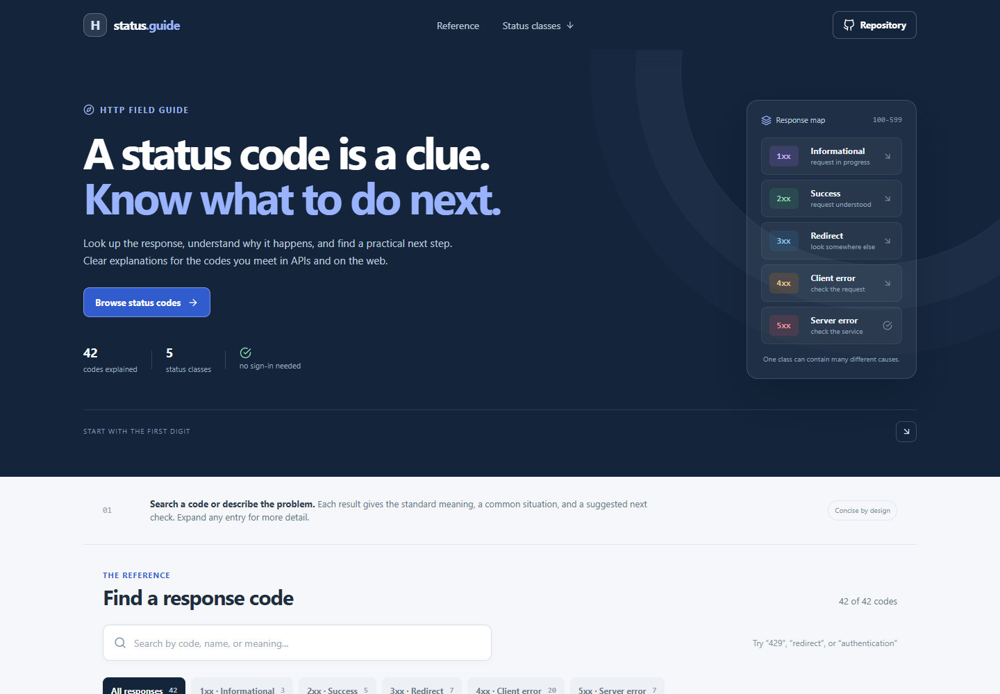



# HTTP Status Reference

Search common HTTP response status codes and get a plain-language explanation of what happened and what to check next. The reference runs in your browser and needs no account or server.

**Live app:** [https://a2rp.github.io/http-status-reference/](https://a2rp.github.io/http-status-reference/)

## How to use it

Search by a code such as 429, a status name such as Not Found, or a phrase such as authentication. Choose a status class to narrow the list. Select **When it appears** on a result to read a typical cause and suggested next check. Use **Copy** to copy its numeric code. Clear the search with the field's clear button, or use the empty-state action to reset both search and class filters.

## What is included

- 42 reference entries across informational, success, redirection, client error, and server error classes.
- Search across code, status name, meaning, common situation, next step, and header notes.
- Status-class filters with counts and a live result count.
- Expandable guidance for when a response appears and what to inspect next.
- One-click status-code copying with success feedback.
- Notes for important response headers, including Location, Allow, WWW-Authenticate, Retry-After, and Content-Range.
- A responsive layout, keyboard-visible focus, an accessible back-to-top control, and direct links to the source repository and HTTP semantics standard.

## Reference scope and limits

The status names and protocol descriptions are based on [RFC 9110, HTTP Semantics](https://www.rfc-editor.org/rfc/rfc9110.html), with additional registered codes from [RFC 6585](https://www.rfc-editor.org/rfc/rfc6585.html). The reference describes common behavior; the status code alone cannot explain a service-specific failure. Read the response body and the API or server documentation for exact requirements. For example, 401 concerns authentication even though its historical name says “Unauthorized.” Code 418 is marked unused by RFC 9110, so the app does not suggest a standard recovery action for it.

Search and filter state exists only in the current page. Nothing is saved to local storage or sent to a server. Copying uses the browser clipboard API and may require a secure page context.

## Run locally

~~~sh
npm install
npm run dev
~~~

## Check and deploy

~~~sh
npm run lint
npm test
npm run build
npm run deploy
~~~

The deploy command builds the site and publishes the dist folder to the gh-pages branch. The live site is [https://a2rp.github.io/http-status-reference/](https://a2rp.github.io/http-status-reference/).

## Future improvements

These are ideas that are not implemented yet:

- Add filters for status-code ranges and request methods.
- Add a comparison view for related codes such as 401 and 403.
- Add curated examples of response headers and API payloads.
- Add localization for code explanations and guidance.

## Links

- Portfolio: [https://www.ashishranjan.net](https://www.ashishranjan.net)
- GitHub: [https://github.com/a2rp](https://github.com/a2rp)
- CodePen: [https://codepen.io/ash1198](https://codepen.io/ash1198)
- LinkedIn: [https://www.linkedin.com/in/aashishranjan](https://www.linkedin.com/in/aashishranjan)
- Facebook: [https://www.facebook.com/theash.ashish/](https://www.facebook.com/theash.ashish/)
- YouTube: [https://www.youtube.com/@ashishranjan-ashz?sub_confirmation=1](https://www.youtube.com/@ashishranjan-ashz?sub_confirmation=1)
- Email: [mailto:ash.ranjan09@gmail.com](mailto:ash.ranjan09@gmail.com)

## Support

- Support: [https://a2rp-donation-page.netlify.app/](https://a2rp-donation-page.netlify.app/)
- Buy Me a Coffee: [https://buymeacoffee.com/ashishranjan](https://buymeacoffee.com/ashishranjan)
- Patreon: [https://www.patreon.com/ashishranjan](https://www.patreon.com/ashishranjan)

